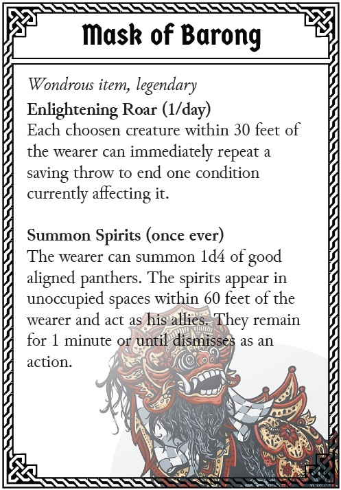

# Session 3 - Arrival in Tirtakencana, Investigation of Banua Tapel and (partly) reveal of the parcel's secret 1700 XP / 14x Encounters
- [Session 3 - Arrival in Tirtakencana, Investigation of Banua Tapel and (partly) reveal of the parcel's secret 1700 XP / 14x Encounters](#session-3---arrival-in-tirtakencana-investigation-of-banua-tapel-and-partly-reveal-of-the-parcels-secret-1700-xp--14x-encounters)
  - [Objectives](#objectives)
  - [Summary](#summary)
  - [Setting](#setting)
  - [NPCs](#npcs)
  - [Quests 600 XP](#quests-600-xp)
  - [Conclusion](#conclusion)
  - [Banua Tapel 825 XP](#banua-tapel-825-xp)
  - [Duyfke 275 XP](#duyfke-275-xp)

## Objectives
Rest up, stock supplies. Quests from `Ketut` High Council for Banau Tapel, receiving the Mask of Bargon, and the north. Parcel delivery to `Victor`. Info about Rifts and quest given to reach Pattana Nana.

## Summary
The group is looking to set in the city, explore maybe a bit, stock supplies. They get rewarded for bringing the survivors to the town by their family members, make the local news and get the attention of `Ketut` – Member of the High Council. `Ketut` is asking them about the incident of the crash landing, and looking for potential evidence of what may have caused the crab to attack. The fact that a member of the High Council is spending time to investigate this is a sign of its significance. There are rumors and stories going around that the water of the north is becoming corrupted and polluted. Nobody knows anything really for sure, since Tirtakencana is quite far away. But if the rumors are true this is something of high significance and unsettling.

`Ketut` will then invite the group to another quest (to see if they are worth it/to be trusted) to travel to Banua Tapel and see what is going on there. Banua Tapel are the ruins of the ancient ancestors and should never be entered to not disturb the guardians that are inhabiting the place. However, evidence has been reported as such that the water flowing from there has turned dark, and that a suffering-sounding panther-like roar has been echoing through the night. The group is sent to investigate.

In addition they deliver the parcel to `Victor`, a quirky crazy mad scientist-like halfling with big eyes, who is explaining to them about the content of the parcel. It contains a magical shard that is used to open a higher plane of existence, but that can also be crazy talk from the people that came to this town years ago - that is all he knows. Yet, the group is tasked to bring it to his friend `KlaewKla` in Pattana Nana for more information. `Victor` also tasks the group with another quest here in Tirtakencana.

There are also two city quests involving laying to rest a ghost as well as going for a sneaky treasure stealing mission in the docks.

## Setting
The city of *Tirtakencana* sits right on the feet of the high mountain range behind it. Huge gates with delicate carvings depicting mythical creatures, emerging out of winding rivers, never-ending fields of flowers and rice terraces. 

The heavy gates open and reveal the dream-like center of Tirtakencana. The name means "abundant holy water", and the name fits quite right. Rivers and cancel flow through all the city — Water is indeed celebrated and worshiped here. There are many fountains, complex "Wasserspiele" where water flows from one container to another, that makes you wonder how all of this stays in sync and in perfect balance. The water's gravitational energy is also used to run complex machines. The entire city is basically a clockwork run by water as its main energy source.

There is a preacher on a makeshift stage telling that the current epoch is coming to an end. Some people gather around it, most just walk by and shake their heads: "You signs are everywhere, if you look close enough!"

`Banua Tapel` means "Village of Masks". The village or rather its ruins are upstream of a mangrove forest river delta. The inhabitants before were exceptional craftsmen with wood carvings etc. mainly masks. Their masks are worth a fortune and legends say that they may have been magical powers, some may be carved from the bones of the gods. However, most of the place has been raided and potential treasures have been taken already.

In the center however is a temple like in Indiana Jones' Raider of the Lost Ark. The entrance to the temple is hidden in a way that it has been overgrown with trees. That has to be found first and then chopped down. Evidence of a former camp and adventure supplies give a hint of the direction to the entrance. Weathered and wittered in appearance.

The temple contains the most important artifact, the mask of Barong. Which is a pather-like mask, that is actually carved from the bones of Keshava and will be relevant way later in the story to summon the guardian of Keshava Bargon to fight against the darkness. However, the spirit of Barong has been fallen ill by the darkness of Shyama. That is also why the water turned dark. In an epic boss fight they have to fight the bad spirit of Barong, and in turn receive the mask of Barong as a reward, and the water will turn clear again.

## NPCs
- `Ketut` Member of the high Council of Tirtakencana [NPC Generator](https://www.kassoon.com/dnd/npc-generator/24000120060100000/1678348680938082/theirastra-berevan-female-elf/)
- `Victor` Quirky character that receives the parcel [NPC Generator](https://www.kassoon.com/dnd/npc-generator/17000120130100000/1678680895563911/kelter-bigheart-male-halfling/)
- A street vendor they bump into selling magical items [Scam Magic Items](../20_Monsters_&_Infos/3_Scam_Magic_Items.jpg)
- Preacher, preaching about the end that is near
- `Katheline` Schoonhoven, running the shop Aurora's Realms Shop

## Quests 600 XP
- *Easy 4x75 = 300XP:*  
If the PCs talk with `Victor` a bit more, or share about the rumors that are coming around, he additionally has a small quest for the group. He is looking for a sample of the dark water that rumors are going around in town. He gives the group a vial, but tells the group not to touch the water.
- *Easy 4x75 = 300 XP:*  
They need a boat to go upstream to Tlabahe Biat? How do they get it? Play by ear here.
- *Med 4x150 = 600 XP:*  
Successful investigation of Banua Tapel and report to `Ketut`, additional group reward of 75 GP per PC.
- *Med 4x150 = 600 XP:* Ngaben  
[Ngaben](https://en.wikipedia.org/wiki/Ngaben), unfortunately the ashes of the unknown-burial have never been collected and properly carried to the holy river in the middle of Tirtakencana. Therefore the burning grounds have been haunted since then. The group has the possibility to convince the ghost, but the ghost is by default hostile. All they need is a coconut shell, and a hint (High Investigation check, Arcana check, Tool from Victor, etc.) to find the ashes of that particular ghost. They can also go offensive about this, but the [Ghost](../20_Monsters_&_Infos/3_Ghost.jpg) is hard to fight.
- *Med 4x150 = 600 XP:* Aurora's Realms Shop (Waterdeep City Encounters p.27 adapted)  
Aurora was an adventurer sorceress who quested the globe before retiring to Tirtakencana to found a lucrative business in exotic goods. Teleportation circles connected her Emporium to outlets across Buana, including this one in the Dock Ward of Tirtakencana. When the characters visit the shop, halfling shopkeeper `Katheline Schoonhoven` casually tells them of a ship being held by the port authorities in the Great Harbor. The Duyfke is carrying treasures from a desert tomb in the Drog'Keth plains around the distant city of Sandriven, but the captain doesn’t have proper paperwork to unload her cargo. Katheline hints that she’d pay a pretty penny to get her hands on those treasures. If the character breaks onboard, use the sailing ship map from appendix C of the Dungeon Masters Guide to manage their progress. At night, the ship is defended by 4x Guards [Thugs](../20_Monsters_&_Infos/1_Thug.png). The 	curio stored in the hold are worth 250 gp to a collector such as Katheline, but anyone venturing inside risks enraging the encased [Orc Mummy](../20_Monsters_&_Infos/3_Orc_Mummy.jpg) held within.

## Conclusion
The group returns to Tirtakencana and gives information about the things going on in the temple. Also the group is now in possession of The [Mask of Barong](../20_Monsters_&_Infos/3_Mask_of_Barong.jpg). They have proven to be worthy of trust and are entrusted with the quest to go north and find out more about the darkness corruption that is going on.

## Banua Tapel 825 XP

1.  Entrance *TRAP 1 – Cobweb Easy 4x75 = 300 XP*  
A bunch of spiders crawling over the PCs and they need to figure out how to get them off before getting bitten and poisoned. Poison (Disadvantage on attack rolls and ability checks).
2.  Expeditions Camp  
A bunch of expedition supplies are stored here from former adventurers that wanted to make their way in. Ropes, rotten food supplies, torches, nails, pick axes, even some wet and unusable gunpowder as well as some empty & cracked barrels etc.
3.  The Pillar *Easy 4x75 = 300 XP*  
From here the temple can be marveled at. A ripping river below full of the dark water observed before Stalactites are handing from the ceiling. The sound of the river is echoing through the entire temple. Making it very difficult to hear anything beyond that. One big boulder falls off the pillar and crashes down. Out of nowhere then the group is attacked by *3x Giant Bats*. Towards the end of the fight, the entire pillar will give in, collapse and fall over, blocking partly the river below.
4.  The First Room  
The group can gather themselves after escaping the collapsing pillar. The way back is now completely cut off and the group has to continue forward. Once they are about to leave the area they hear the panther-like roar that sounds very dark, hollow and a bit of suffering echoing through the temple. Dust and sand starts trickling down on the group's heads.
5.  The First Hallway  
If they take the time to investigate they can find a door to a secret passage to 9. Otherwise they will need to find a way over the gaping hole to the next area. Where was once a bridge before, is now a gaping hole. Only some rotten wooden posts where a bridge was tied to are left. Are they sturdy enough? If a member falls, they can limit the damage by targeting the deeper parts in the river below, but will be washed out the temple. Maybe they can hold on the pillar in 3?
6.  The Second Hallway  
This is a mirror of the first hallway, however the small niche from 5 is now bricked off or rather hidden. The PCs can investigate to find a hidden niche 6 and/or the secret passage to 7.
6a. Following the stairs down lead into a storage room with plenty of pots that contain rotten oils for fires, tar, cotton rags, some arrowheads, spears, darts, etc. As well as 4x Potion of Healing (2d4+2 OR flat 7).
6b. A small side room with some gold pieces and a wooden mask. 
7.  *TRAP 2 – SPIKE TRAP Easy 4x75 = 300 XP*  
Somehow triggered by interrupting a beam of sunlight, this is clearly a magical trap and the group needs to use their Intelligence (Arcana) skill to detect it. Trap can be disabled by triggering it in a controlled way however the trap will reset after a while.
8. The Bypass  
Former adventurers who have been here, and did not find the secret way started digging through the stone to create their own passage. The PC can continue here and will find the way to the other side and ultimately a bridge. However a boulder blocks the way to the left, so they have to cross to the right.
9.  *TRAP 3 – DART TRAP Easy 4x75 = 300 XP*  
Next we have the (probably poison) dart trap. On a successful Intelligence (Investigation) check, the group will find the trigger. Once the trigger is identified (camouflaged with a covering of dirt), the group can easily recognize the other triggers. Either disabling it or instead makes a Dexterity (Acrobatics) check to make their way across the room.
10.  *TRAP 4 – THE ARENA Hardish 4x225 = 900 XP*  
Once the PCs have entered this room full of bones on the bottom. Suddenly all doors close and lock. And a fight begins like in an arena. 2x Skeletons (50 XP) swap and after one more round 2x Skeletal Alchemist (100 XP) and 1x Swarm of Bones (100 XP) summoned by the Alchemists.
11.  The Third Hallway  
Almost looks like living quarters. Quite homey. A door is leading to area 12 and 14. Once they enter the area hearing the panther-like roar again, louder and closer.
12.  The carveres quarters  
Looks like someone was living here before. It has been quite some time, but there are notes about masks, different carvings, drawings of a panther-like creature.
13.  Secret room  
Hidden in this room are books about the lore of the ancient epoches, specifically about Keshava and their siblings. As well as a diary that is blank after the first page. It is only visible what is written in it to the owner. It looks like that some page has been written, but of course can't be read. However the PC's can attune to it and make it their own. Also they will find a [Scroll of Protection](https://criticalrole.fandom.com/wiki/Scroll_of_Protection) (against celestials)
14.  The Fourth Hallway  
A normal hallway with a small makeshift bridge to the next area as well as another room around the corner.
15.  The Room of Masks  
The wall is full of wooden masks, some of them simple, some of them very delicate and beautiful. However, there has been a change here. The room looks relatively fresh. Less dust, some crates have been moved.
16.  *BOSS FIGHT Hard 4x225 = 900 XP*  
Fight against possessed Barong. After the fight the boss disappears and the [Mask of Barong](../20_Monsters_&_Infos/3_Mask_of_Barong.jpg) falls down right in front of the group. There is not much time to loot, as the temple is collapsing.
17.  *TRAP 5 – BOULDER CHASE Easy 4x75 = 300 XP*  
After the boss fight the shaky bridge will fall into the river, but a big crack in the wall opens to the left of the PCs. This seems to be the most promising and only exit as of now. However, as they exit a big boulder breaks loose and chases the group. (this is basically like a chase, however the PCs are not the ones chasing, but being chased.)

## Duyfke 275 XP
2x Guards are patrolling on the pier, another 2x are on the boat which do their patrolles on upper and lower deck in fixed timings. The PCs can spend time observing that pattern and act accordingly. Stealth is key, as offense would just result in fight. Nobody else is on the boat. The boat is from the Caravan Guild, a merchant faction in the far west of Buana. There are maps giving the PCs a bit of insight of the world of Buana - of that that is open for trading with the Caravan Guild at least. There is some random loot, commonplace items and daily supplies on the boat.

If they reach the center of the lower deck and be quiet about it, they can lift the sarcophagus with 2x people. However they are not overburdened and therefore half the speed. As well have disadvantages on stealth checks. If they drop or throw the sarcophagus the Mummy will awake and break out on a successful 15 DC Strength check. The group can try to rope the sarcophagus, or do any other means to keep it closed. The [Mummy](../20_Monsters_&_Infos/3_Orc_Mummy.jpg) lucky is mute.

> ## Barong (possessed)
> https://aminoapps.com/c/officialdd/page/item/singo-barong/X0k5_DdjcXI78vnbN8RR4Jnbp3ZQdKr5aXL  
> *Large celestial, Chaotic Evil*
> ___
> - `Armor Class` 13 (natural armor)
> - `Hit Points` 75 (10d10 + 20)
> - `Speed` 50 ft.
> ___
> |STR|DEX|CON|INT|WIS|CHA|
> |:---:|:---:|:---:|:---:|:---:|:---:|
> |15 (+2)|17 (+3)|14 (+2)|6 (-2)|11 (+0)|12 (+1)|
> ___
> - `Saving Throws` Dex +5
> - `Skills` Athletics +4, Perception +2, Stealth +7
> - `Damage Resistances` psychic
> - `Condition Immunities` charmed
> - `Senses` blindsight 60 ft., passive Perception 12
> - `Languages` Celestial, Common, Deep Speech
> - `Challenge` 4 (1,100 XP)
> ___
> `*Jasmine Scent.`* Barong gives off a strong scent of jasmine. Creatures have advantage on Wisdom (Perception) checks that rely on smell to locate Barong.
>
> `*Pack Tactics.`* Barong has advantage on an attack roll against a creature if at least one of the Barong's allies is within 5 feet of the creature and the ally isn't incapacitated.
>
> `*Pounce.`* If Barong moves at least 20 feet straight toward a creature and then hits it with a claw attack on the same turn, that target must succeed on a DC 16 Strength saving throw or be knocked prone. If the target is prone, the Barong can make one bite attack against it as a bonus action.
>
> `*Running Leap.`* With a 10-foot running start, Barong can long jump up to 25 feet.
>
> `*Psychic Resonance.`* Barong's presence causes migraine, nausea, and disturbed vision. Each creature within 10 feet of Barong must make a DC 14 Intelligence saving throw at the start of each of their turns. On a failed save, a creature is stunned until the start of its next turn. 
>  
> Optionally, if the optional rule of the Sanity ability score is being used, a creature that fails its third save against this effect during a span of 24 hours must immediately make a DC 14 Sanity saving throw, and every time it fails its Intelligence saving throw for this trait after then. On a failed Sanity save, the creature is afflicted by a short-term, long-term, or indefinite madness, as described in chapter 8 of the Dungeon Master's Guide, and its Sanit score is reduced by 1 as per the usual Sanity saves' effects.
> ### Actions
> `*Multiattack.`* Barong uses its Assert Dominance action and then makes one weapon attack.
>
> `*Bite.`* Melee Weapon Attack: +5 to hit, reach 5 ft., one target. Hit: 14 (2d6 + 3) piercing damage.
>
> `*Claw.`* Melee Weapon Attack: +6 to hit, reach 5 ft., one target. Hit: 12 (2d6 + 4) slashing damage.
>
> `*Assert Dominance.`* Barong moves the feathers on its head in an hypnotic pattern, trying to penetrate the minds of the weakened. A stunned creature within 30 feet of the Barong that it can sense must make a DC 14 Charisma saving throw. On a failed save, the creature is dominated by Barong until either creature falls unconscious. A dominated creature is charmed by the Barong and the Barong has a telepathic link with the creature. 
>  
> Barong can also use this action again to cast the Command spell on a dominated creature, issuing its command telepathically, not requiring any saving throw, and ignoring the restriction of not being able to issue commands directly harmful to the target. If the Barong issues a command in this way, the target stops being stunned until it has brought that command to a conclusion.
> ### Reactions
> `*Weave Disturbance (Recharge 5-6).`* When a creature within 5 feet of Barong starts casting a spell, the Barong can use its reaction to make a special claw attack against that creature before the spell is actually cast. This special attack deals psychic damage instead of the attack's normal damage type, and it disrupts the creature's casting so much that if they are concentrating on a spell, that creature has disadvantage on the saving throw it makes to maintain its concentration. This also applies if the spell that triggered this reaction requires concentration, and if this is the case and the caster loses its concentration on that spell as a result of Barong hitting it with this reaction, the caster's spell doesn't take effect, but the caster's spell slot or use of that spell is considered consumed anyway.

